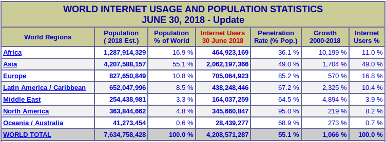
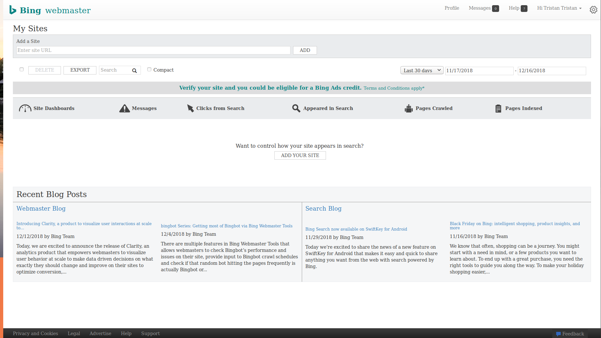
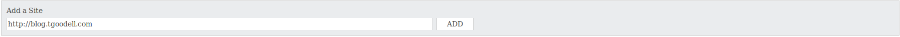

# A Look at Bing Webmaster Tools

_Tristan Goodell on [Tutorial](../tags/tutorial.html), [Website](../tags/website.html) | 19 Dec 2018_

## Why?

Simply put, not everyone uses Google as their primary search engine. Although there are contradicting statistics out there about search engine market share, a strong minority still use Bing as their primary search engine. Furthermore, [Yahoo search is powered by Bing](https://arstechnica.com/information-technology/2010/08/yahoo-transition-to-bing-finalized-in-us-canada/). 

According to [netmarketshare.com](https://www.netmarketshare.com/search-engine-market-share.aspx?options=%7B%22filter%22%3A%7B%7D%2C%22dateLabel%22%3A%22Trend%22%2C%22attributes%22%3A%22share%22%2C%22group%22%3A%22searchEngine%22%2C%22sort%22%3A%7B%22share%22%3A-1%7D%2C%22id%22%3A%22searchEnginesDesktop%22%2C%22dateInterval%22%3A%22Monthly%22%2C%22dateStart%22%3A%222017-12%22%2C%22dateEnd%22%3A%222018-11%22%2C%22segments%22%3A%22-1000%22%7D), Bing has a market share of 4.52%. Yahoo has a market share of 2.39%. While that may not seem like a lot, it is. When [4,208,571,287](https://internetworldstats.com/stats.htm) people use the internet worldwide, a combined 6.91% is massive! That is an astounding 290,812,275 people! 

Besides the obvious reason for reaching more people just through Yahoo and Bing, I also wanted to target more people that use meta search engines like [DuckDuckGo](https://duckduckgo.com) and [Startpage](https://startpage.com).

---

## Step 1 - Signing Up

Head over to [Bing Webmaster Tools](https://www.bing.com/toolbox/webmaster/). You will need to sign in/up with a Google, Facebook, or Microsoft account. Annoyingly, you cannot create an account _just_ for the Bing Webmaster Tools. If you click "Sign Up", you are prompted with the same message as if you clicked "Sign In". 

Once you complete the Sign In/Up process, you will be greeted with a screen like this:

## Step 2 - Adding a Site

Simply add a site in the box as shown below and click "Add".

You will then be greeted with a page asking for information ranging from a sitemap to your industry type.

Next, you will have to verify that you actually own the site. You will be greeted by three options for verification: 

- Placing an XML file on your web server.

- Add a <meta> tag to your default webpage (i.e https://tristangoodell.com)

- Add a CNAME record to your DNS. 

All three are fairly self-explanatory. Choose whichever one you prefer. 

## Step 3 - Tweaking!

There is a massive list of customizability options here. These include:

### Configure My Sites

- Sitemaps: list a sitemap to be crawled.

- Ignore these URL Parameters: to remove duplicate page queries

- Crawl Control: the time of day Bing should crawl your site.

- Deep Links: prevent URLs from appearing as deep links in Bing search results.

- Block URLs: prevent certain URLs from being indexed. 

- Disavow Links: tell Bing about links that point to your site that you do not trust. 

- Geo-Targeting: Target a specific country with pages or the entire site.

- Verify Ownership: verify that you actually own the property (this was already done).

- Connected Page: connect related web presences such as social media to your site and search results. 

- Users: grant new users permissions to view and edit Bing Webmaster Tools for your website.

### Reports & Data

- Page Traffic: view the top pages from organic search results.

- Page Mobile Friendliness: ensure that your pages are mobile friendly. 

- Index Explorer: see how Bing sees your site.

- Search Keywords: view the keywords associated with your site in search results.

- SEO Reports: bi-monthly reports for whether or not your site is in compliance with SEO best practices. 

- Inbound Links: a list of external websites that have pointed to your content.

- Crawl information: view crawl errors and other data from the latest crawl.

### Diagnostics & Tools

- Mobile Friendliness Test: a simple test to determine whether or not your site is mobile friendly.

- Keyword Research: determine what volume of searches origenate from a certain phrase.

- Fetch as Bingbot: view crawl data from Bingbot.

- Markup Validator: display errors when markup code is incorrect or i the wrong place.

- SEO Analyzer: crawl a page and determine if the page uses SEO best practices.

- Verify Bingbot: Useful for identifying Bingbot in Analytics.

- Site Move: notify Bing for URL changes.

### Security

- Malware: view Malware-infested URLs associated with your site.

- Phishing: view Phishing URLs associated with your site.

- Track Certificates: view certificates requested by visitors.

I would not bother with the group _Widgets_. Likewise, _Messages_ is fairy self-explanatory.

---

Hope this helped! 

Email: [contact@tgoodell.com](mailto:contact@tgoodell.com)

Mastodon: [@tgoodell@mastodon.technology](https://mastodon.technology/@tgoodell)