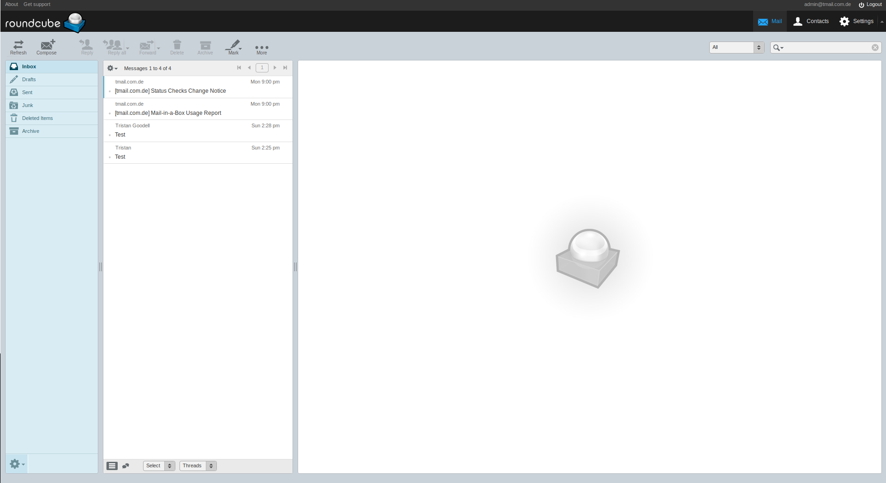
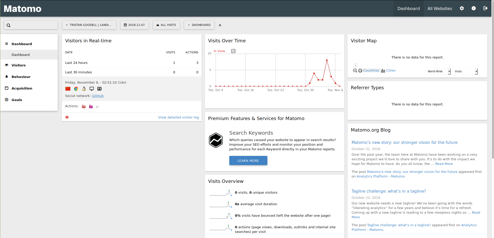
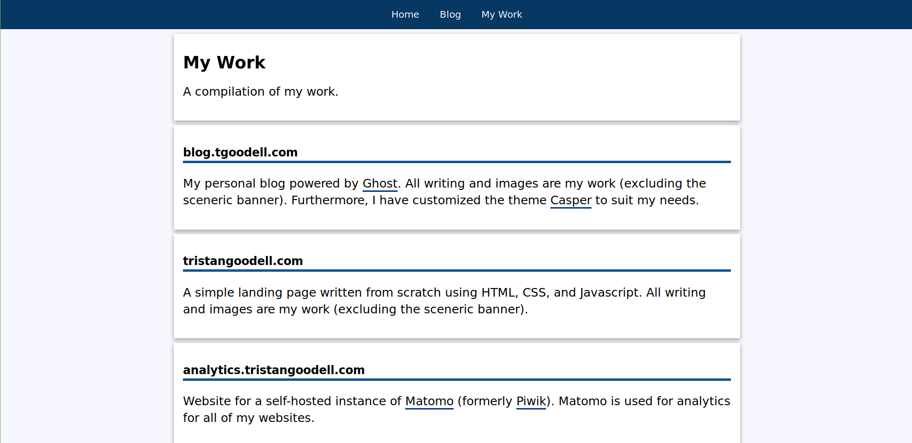

# A Productive Week

_Tristan Goodell on Update | 09 Nov 2018_

I think that the past week has been the most productive week ever for me. I set up self-hosted email and analytics, experimented with Wordpress, and restructured my landing page and blog.

## Self-Hosting Email

Sort of. The vast majority of Internet Service Providers (ISPs) block the necessary ports to host a email server. Furthermore, many residential IP Addresses are blacklisted for spam. Instead, I am hosting a [Mailinabox](https://mailinabox.email/) instance on a [Digital Ocean Droplet](http://pages.news.digitalocean.com/dcn/AyKQ30vur1Nt8H30LIWxk-j5xHmafGnoECQwn1ooO75-n4tuZXTwGdYjSIr5qbK0xTcckfnLm_U1fCT4uON9bg==/Y0Vs207XI00WN0236IE03D7).

I decided to switch from the free [Zoho Email Business plan](https://www.zoho.com/workplace/pricing.html?src=zmail) to a self-hosted solution for a few reasons. As explored in my [blog post](https://blog.tgoodell.com/setting-up-free-custom-domain-email-with-zoho-mail/) on the topic, the free plan of Zoho Email has a few limitations:

- A limit of 25 users.
- Webmail and App support only (no IMAP/POP).
- 25mb Attachment limit.
- A limit of 5GB of storage per account.
- Only one domain.

I simply wanted an alternative to Zoho that allowed for more flexibility for my specific situation. I still recommend the Free Plan if you only have one domain and are okay with the restrictions.  

Anyway, setup was fairly simple. Multiple domains are supported along with Webmail and POP/IMAP. Although the webmail interface [Roundcube](https://roundcube.net/) looks a bit dated, it is manageable.

There are still a few issues that I want to sort out such as the emails sent ending up in Gmail's spam folder, but overall I am pretty happy with Mailinabox. If you are interested in setting up your own instance, this guide is superb.

## Self-Hosting Analytics

You may be sensing a pattern now. At the start of my website projects, I configured Google Analytics but rarely use it. I decided that I wanted to start analyzing if I even have an audience and how to grow said audience.

I really was not pleased with Google Analytics. It is confusing to traverse and has some privacy issues. I decided to do some quick research and cam across Piwik.

This Piwik sounded great. It was: (1) free open-source software, (2) easy to use, and (3) had extensive GDPR and privacy support. Only slight issue is that Piwik is no longer a thing; [it is now Matomo](https://matomo.org/blog/2018/01/piwik-is-now-matomo/).

Matomo is run by the same people (they were not bought out or anything). As explained in their announcement they mainly changed the name because:

> Piwik, the community project, will now become Matomo. The only change is our name, everything else stays the same.

Also:

> we also want our name to be unique, ensuring that it is not shared with  any other company to remove any possible confusion or affiliations.

Makes sense. You really do not want name recognition issues.

Anyway, setup was pretty easy. Thankfully, Matomo is written in PHP and will run on any web server. This means that I can place it on my Ubuntu Virtual Hosts server. A guide explaining how to set this up can be found [here](https://blog.tgoodell.com/guide-to-apache-virtual-hosts/).

Setup was very straightforward. Here is the official [Matomo installation guide](https://matomo.org/docs/installation/).

Of course, having analytics installed on my various websites clearly shows that I really have no audience (RIP). Guess I should probably fix that.

## Trying to Install Wordpress

Earlier in the week, a friend of mine approached me and asked for assistance in setting up a website.

He is interested in coding and engineering and simply wanted a website to play around with. My immediate thought was: "Hey! Wordpress is considered an easy to use Content Management System. It will be Great!"

So, we purchased a domain for him, installed [Wordpress](https://wordpress.org/) on my Apache Virtual Hosts server, and expected to have smooth sailing from then on out. However, issues immediately appeared.

The first issue was quite simple: themes and plugins could not be downloaded because there was no FTP server. Simple enough... or so I thought.

It took me forever to actually configure an FTP server and ensure that all of the configuration files were up to par. Then, another error appeared. Fixed that. Then, another. At this point in time, I was almost to the point where I wanted to quit. And then... I discovered that there was a very simple line of code that could fix this issue if placed into `wp-config.php`.

`define('FS_METHOD', 'direct');`

I felt really stupid. There was another issue that popped up: the live theme customization preview displayed a white screen.

Super weird. I could not find out anything on the internet, so I decided to setup a temporary test server with Apache Virtual Hosts to see if I messed up anything.

Nope. Still the white screen.

Finally, I used Digital Ocean's one-click Wordpress Droplet. Still the white screen. Wordpress is terrible.

I decided to just not use Wordpress. Now, I am going to learn how to use [October CMS](https://octobercms.com/).

## A New Landing Page

I decided to build a new landing page for myself. Just a website with a short bio and ways to contact me as well as links to my projects.

The plan was to move the blog (the site that you are reading this post on) to https://blog.tristangoodell.com/ and to have the landing page on https://tristangoodell.com/. Only issue is that blog.tristangoodell.com only worked when Cloudflare's SSL setting was set to "strict" whilst tristangoodell.com only worked when the setting was set to "flexible".

I think that this is due to Ghost automatically applying for a Let's Encrypt certificate. This issue is documented [here](https://support.cloudflare.com/hc/en-us/articles/115000219871). New plan is as follows:

- tristangoodell.com - landing page
- blog.tgoodell.com - blog

That is the current setup at the time of writing this. Knowing me, I may change it (again).

Anyway, the new [landing page]() looks like this:

There is also a page of [my work](https://tristangoodell.com/work.html) that I will (try to) keep up  to date:

## Goals for the Future

I will end this off with a few projects that I want to do in the near future.

- Purchase a PO box so that I can start to send out email newsletters (CAN-SPAM legislation).
- Build a site-map or sites-map and to figure out SEO.
- Get off of Gmail's spam list.
- Continue building upon the Home Sweet Home Ghost theme (built off of Casper).
- Find a compelling social media platform.
- Blog more often.

---

Thank you for reading!
