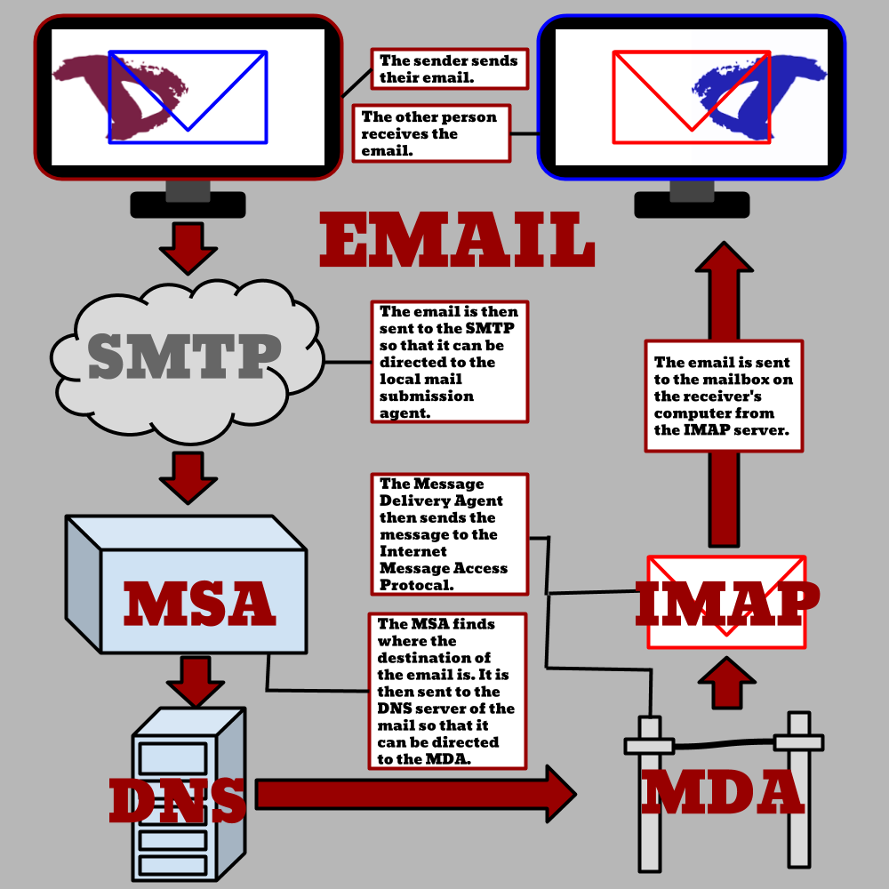

# AP Computer Science Principals - A Practice Explore Task from 2017

_Tristan Goodell on School, AP, Email | 10 Dec 2018_

## Background

I took AP Computer Science Principals last year (2017). In September of 2017, we built a mock artifact in preparation for the AP Exam. I decided to write and design the artifact around Email.

Unlike a lot of AP Exams, the AP Computer Science Exam is split up into several non-exam parts. Consequently, we prepared throughout the latter half of 2017 and early 2018 with various practice portions.

For AP Computer Science Principals, the exam look something like this:
- Explore Task
- Create Task
- End-of-Course Exam

The Explore Task involves research into a "computing innovation" and then creating a "computational artifact" with written responses.
According to College Board (the people behind AP):

> Computing innovations impact our lives in ways that require considerable study and reflection for us to fully understand them. [...] A computing innovation is an innovation that includes a computer or program code as an integral part of its functionality.

Similarly, a computational artifact:

> [...] must provide an illustration, representation, or explanation of the computing innovation’s intended purpose, its function, or its effect. The computational artifact must not simply repeat the information supplied in the written responses and should be primarily nontextual.

There are two distinct parts of the Explore Task: the computational artifact (a graphic) and a written response.

---

## The Artifact

This is very complicated and probably overly so. I used [Google Drawings](https://docs.google.com/drawings/) (what else are you supposed to use on Chromebooks?) to design everything from scratch. The only portion that was not created by myself are the two [Disroot](https://disroot.org/) logos.

I think that overall, this graphic fulfills its purpose. However, it is certainly not the best graphic out there.

---

## The Written Response

2a. The computing innovation that I chose is email and my computationalartifact displays the process in which an email is sent from computer (a)to computer (b). The email’s main function is to help two or more peopleon separate computers communicate, as shown in the artifact.

2b. The development of my artifact was certainly time consuming; my first step was to do research of the history of the email, how it works, and its evolution on sites like http://www.nethistory.info​/. After doing some very in depth research, I decide to find out what exactly each part of the email train looks like, or something that symbolizes it. I then crafted basic images using shapes in Google Drawings. Finally, I cleaned up some rough edges, improved aesthetics, and labeled each landmark of the email’s journey.

2c. One of the positives of email is that people on other sides of the world, can communicate at lightning fast speeds; the spread of information, ideas, and beliefs have never been easier. Instead of mail taken months to get from the United States to Canada, it now takes mere seconds. This advantage comes at great cost, however, conventional mail is no longer as popular and as used after email was introduced to the consumer. Although the written note is stall popular in the professional world, mail has declined due to the rise of email. Gone are the days where we would save a beautifully written note from family, a college, or a friend; now we just send it to the trash folder. We may have lost something when we did that.

2d. The email uses the data from the message, where it originates, and it where it goes. The message is inputted into the SMTP, and then goes on a journey until the message is outputted at the recipient’s computer. There is a massive data privacy concerns; emails are not encrypted as much as they should. Some email providers provide NSA level encryption, most don’t and when those encrypted email services do, it is invalid when it communicates outside of the email service. Furthermore, a little known law in the United States allows the government to seize any and all emails, information in the cloud, search history, web history, and more without a warrant when your data is over six months old. One way to circumvent this is by using an email service based outside of the US, like Disroot, however Google has the largest market share with its Gmail. When we switched from mail to email, we gave up privacy to both the government and private corporations who are known to scan the contents of email for targeted ads.

---

## Get In Touch

If you are currently or considering taking AP Computer Science Principals, feel free to reach out to me for assistance or an opinion. Comment below or email me at [contact@tristangoodell.com](mailto:contact@tristangoodell.com) if you would like to reach out.

Thank you for reading!
