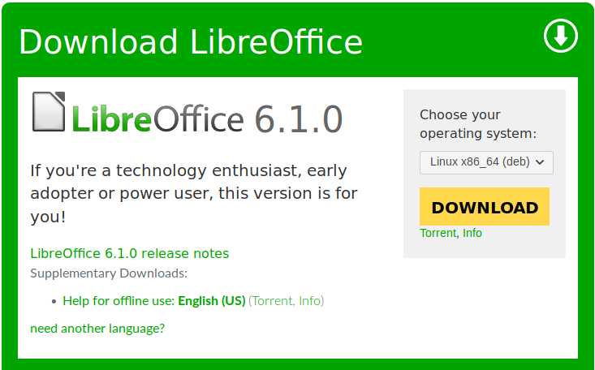
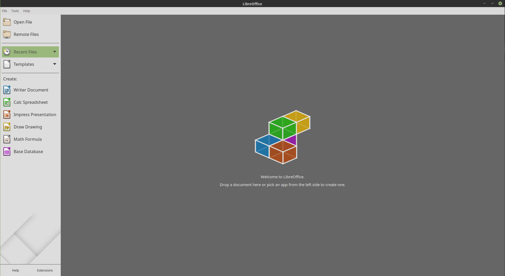
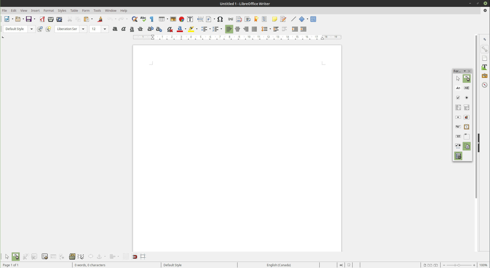
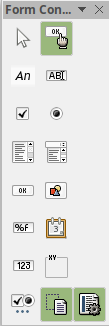

# How to Create Fillable PDFs Using LibreOffice

_Tristan Goodell on Tutorial | 31 Aug 2018_

There are many ways to create PDFs that can be used for forms for potential clients to fill out. The most notable is through [Adobe Acrobat](https://acrobat.adobe.com/us/en/acrobat/how-to/create-fillable-pdf-forms-creator.html), however that ability comes with a $14.99/month price tag. Furthermore, there are several online services that may allow you to do this, but they are very much limited in their range and function.

I wanted a versatile option that is inexpensive, if not free. Then, I remembered a handy suite of apps that comes with almost every Linux distribution preinstalled: [LibreOffice](https://www.libreoffice.org/).

[LibreOffice](https://www.libreoffice.org/) is a free and open-source suite of productivity applications, similar to [Microsoft Office](https://products.office.com/en-us/home). The main difference here is that Microsoft Office can cost upwards of $70/year!

So, if you do not already have LibreOffice on your system, [click here to download it for Linux, Mac OS, or Windows](https://www.libreoffice.org/download/download/). Simply Select your operating system and click "download".

Once you have downloaded LibreOffice, launch it. You should see something like this:

You are greeted by 6 options:

- Writer Document - Simple Text Document for Essays and Papers
- Calc Spreadsheet - A spreadsheet for budgets and the like
- Impress Presentation - A slideshow presentation
- Draw Drawing - create a drawing
- Math Formula - a math formula program
- Base Databases - modify and create databases

We want to use the Writer Document. Click on it and you will be greeted by a screen similar to this:

Navigate to View -> Toolbars and then select "Form Controls". A new toolbar will pop up:

Hover over each icon to see what each does.

- Select
- Design Mode
- Label
- Text Box
- Check Box
- Option Button
- List Box
- Combo Box
- Push Button
- Image Button
- Formatted Field
- Date Field
- Numerical Field
- Group Box

Create a document with all of the needed input types. Once you have a finished product or simply want to test out your PDF form, click the icon in the icon bar that reads "Export as a PDF". Save the file and open it up in any PDF viewer.

Your client should be able to input text or select certain options that you specified. Now, they can simply save the file and send it back to you! You now have a versatile way to build forms to collect information for your venture!

Links:

- [LibreOffice MacOS download](https://www.libreoffice.org/download/download/?type=mac-x86_64&version=6.1.0&lang=en-US)
- [LibreOffice Windows download](https://www.libreoffice.org/download/download/?type=win-x86_64&version=6.1.0&lang=en-US)
- [LibreOffice Linux .deb download](https://www.libreoffice.org/download/download/?type=deb-x86_64&version=6.1.0&lang=en-US)
- [LibreOffice Linux .rpm download](https://www.libreoffice.org/download/download/?type=rpm-x86_64&version=6.1.0&lang=en-US)

Follow Me Here:

- [Github](https://github.com/tgoodell)
- [Twitter](https://twitter.com/TristanGoodell)

New posts are (usually) weekly! Thanks for reading!
