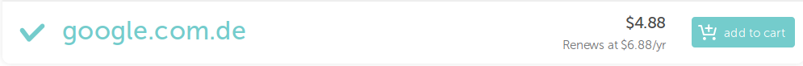

# Phishing and .com.de

_Tristan Goodell on Opinion | 02 Nov 2018_

On the surface, .com.de appears to be just another domain extension, however there is a slight issue that is a result of its introduction.

There is actually a surprising lack of information about this TLD out there. They have a [website](https://com.de/index-de.php). On said website we learn:

> After the Sunrise launch phase, for Trademark holders, anyone  will be able to register a .COM.DE domain. They are completely  restriction free.

That is fair. Only issue is that presumably the 'Sunrise launch phase' is over, and there are quite a few trademarked names that are up for grabs.

I have actually not been able to find a release date for the .com.de TLD. I have been able to find a few articles mentioning it in 2011. [Here](https://com.de/news/neue-comde-domains-koennen-ihre-de-domains-beschaedigen.php) is one such case.

Below are just a few of the household name domains that are available under the .com.de extension.

- google.com.de

- amazon.com.de

- microsoft.com.de

- facebook.com.de

- tesla.com.de

- ti.com.de

- namecheap.com.de

- digitalocean.com.de

- And more!

---

## Phishing with .com.de

The real issue here is the fact that so many well-known company domains are up for sale under .com.de. In a [study conducted by Intel Security and CBS News](https://www.cbsnews.com/news/majority-of-americans-fall-for-email-phishing-scams-cbs-intel-security-quiz/), over 80% of Americans fall for email phishing attacks.

A lot of the time phishers use domains that can be identified as phishing domains in retrospect. However, when an attacker uses a domain that looks legitimate, such as google.com.de or facebook.com.de, they may not be able to identify said domain(s) as the culprit for a phishing attack.

How is an end user supposed to differentiate between the real domain and fake domain when both looks nearly identical? They don't.

Personally, I am pretty surprised that a potential attacker has not registered any of these domains thus far. This could potentially negatively affect quite a lot of people. For example, Facebook alone has 2.23 billion active users.

## To Conclude

To sum up, countless domains are available under the .com.de banner that would otherwise be taken. These domains are inexpensive and have zero residency requirements. This allows pretty much anyone to phish various entities (which is never a good thing).
