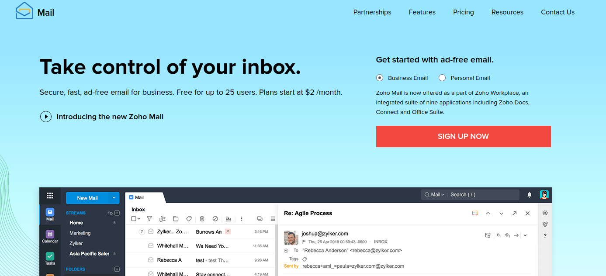
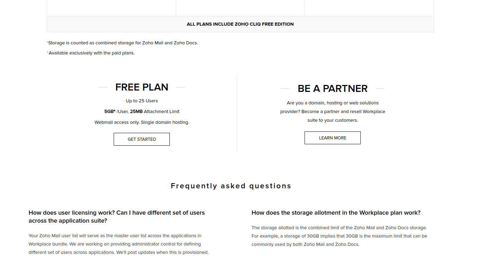
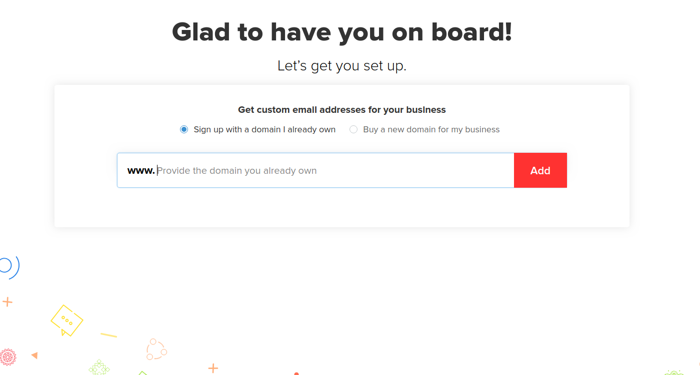
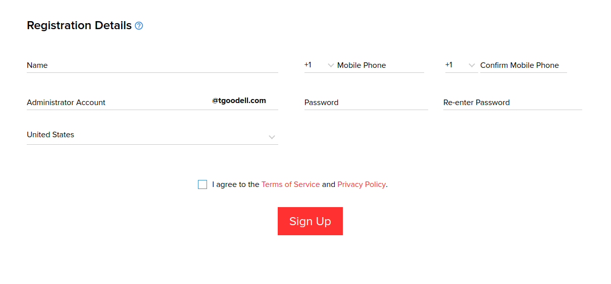
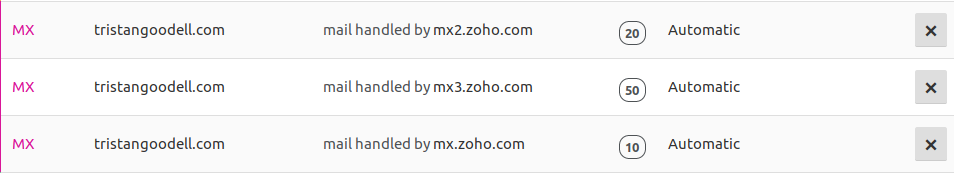

# Setting Up Free Custom Domain Email with Zoho Mail

_Tristan Goodell on Tutorial, Email | 10 Aug 2018_

I think that it is fair to say that anyone who has a website or an online presence needs an email with your domain behind it; it builds up your credibility and it isn't that difficult to setup.

I wanted to get multiple @tristangoodell.com emails for various reasons, so I thought that this may be an excellent opportunity to share my experiences with you, so that you can get your free email up and running much faster than I could.

---

## Step 1

Ensure that you have a registered domain with a registrar.

I highly suggest that you use [Namecheap](https://www.namecheap.com/); They have very affordable prices and they are actually the registrar that I use.

They have sales all the time, and if you are a student, you can get a [free .me domain](https://nc.me/).

Once you have signed up for an account and registered your domain, move on to Step 2.

## Step 2

Navigate over to [Zoho Mail](https://www.zoho.com/mail/?zmc=zoho-fa) and make sure that Business Email is selected.

Click Sign Up Now. Scroll Down a little bit until you see the Free Plan.

> The Free Plan allows you to have:Up to 25 UsersEach of those 25 Users will (1) Have a custom domain email and (2) Each > > user will have 5GB of storage to store email and other documents.Some Drawbacks of the Free Plan are:A 25 MB Attatchment limitWebmail access only; no traditional email clients with POP/IMAP. You can use the webmail intertface on Desktop and the Zoho Mail app for mobile (iOS / Android).

Click Get Started under Free Plan.

Simply submit your domain in the text box.

Fill out the necessary details and click Sign Up.

## Step 3

Eventuelly, you will be prompted to verify your domain. You will be given a string of characters that you must place in a txt record in your DNS records. If you are using [Cloudflare](https://cloudflare.com) to manage yout DNS records, here is a [guide](https://support.cloudflare.com/hc/en-us/articles/200168946-How-do-I-add-a-TXT-record-).

Next, you will be allowed to add new users. After that, you will be able to add groups that you can add users to. You can split up groups via departments or from another variable.

You will need to add three MX records next:

Replace `tristangoodell.com` with `@`. This will automatically change into your hostname. Ensure that you mark the priority as well.

Once DNS records sync up, you are ready to finish the last few steps!

To help ensure that our emails are not misidentified as spam, we need to configure [SPF](https://www.zoho.com/mail/help/adminconsole/spf-configuration.html) records.

Add another `txt` record with the following details:

You can optionally perform email migration or go ahead and download the Zoho Mobile emails clients, however you are effectively finished.

You now have free email with a custom domain!

---

Links of Interest:

- [Zoho Mail](https://www.zoho.com/mail/?zmc=zoho-fa)
- [Namecheap](https://www.namecheap.com/)
- [Namecheap Student Deal](https://nc.me/)
- Zoho Email Clients: [iOS](https://itunes.apple.com/us/app/zoho-mail-email-calendar-contacts/id909262651?ls=1&mt=8) | [Android](https://play.google.com/store/apps/details?id=com.zoho.mail&referrer=utm_source=mail_mobile_page_top&utm_medium=appbadge&utm_campaign=mail_mobile_page)

You can find me here:

- [Twitter](https://twitter.com/tristangoodell)
- [Github](https://github.com/tgoodell)
- [Other Contact Information](https://blog.tgoodell.com/contact.html)
